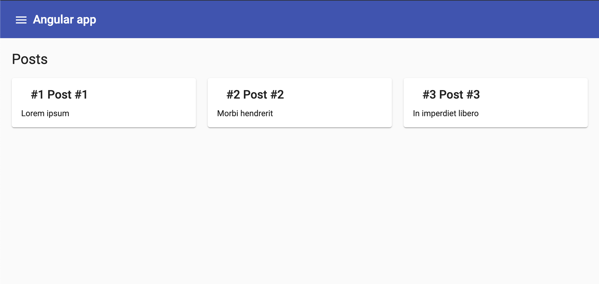

# Angular Starter

Angular starter project with dev API based on JSON Server.

## Tech stack:

* [Angular](http://angular.io)
* [Angular Material](http://material.angular.io)
* [Angular CDK](https://material.angular.io/cdk)
* [Angular Flex-Layout](https://github.com/angular/flex-layout/wiki/Responsive-API)
* [JSON Server](https://github.com/typicode/json-server)
* [ng-mocks](https://github.com/ike18t/ng-mocks)

## Development server & API

* `npm run start` for a dev server. Default http://localhost:4200/
* `npm run api` for a dev api. Default http://localhost:4210/
* `npm run build-prod` to build app for production

## Adding new resources

* add interface that defines a resource in `projects/dev-api/types`
* add collection of records in `projects/dev-api/mocks`
* add custom routes in `projects/dev-api/routes`
* connect mocks in `projects/dev-api/db.ts`
* connect custom routes in `projects/dev-api/routes.ts`

You can use `@api/types/*` path for accessing types in app. 

You can use `@api/mocks/*` path for accessing mocks in unit tests. 

## NgModules

* `AppModule` - should not be changed.
* `CoreModule` - is used to import NgModules that should be loaded only once
* `SharedModule` - is used to provide shared declarations and export widely used NgModules
* `MaterialModule` - is used to handle the list of required Material Modules
* `TestingModule` - is used to export widely used NgModules in component unit tests

## Testing

* use `ng-mocks` for mocking declarations (ex. `MockComponent(SomeComponent)`) 
* use `@testing/mock-helpers` for mocking services (ex. `MockService(SomeService)`)
* use `TestingModule` in component tests

## Preview

## Author

[Tomasz Borowski](http://tbprojects.pl)
